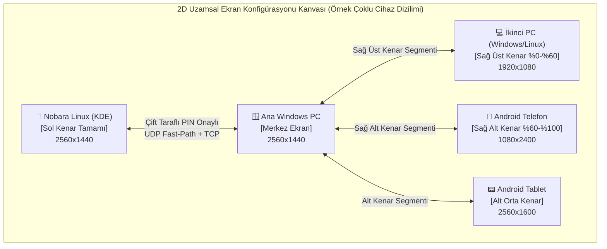

# Connect Me — Application Design Document (ADD)

**Proje Adı:** Connect Me  
**Organizasyon:** Korgan Games (`korgangames/Connect-Me`)  
**Sürüm:** 1.2 (Çoklu Cihaz Mesh, 2D Ekran Konfigürasyonu GUI ve Çift Taraflı 6 Haneli PIN Doğrulaması)  
**Hedef Platformlar:** Windows (10/11), Android (10+), Linux (Nobara — KDE Plasma Wayland)  
**Bağlantı Teknolojileri:** Hibrit Wi-Fi (LAN / mDNS / QUIC-UDP-TCP) + Bluetooth (BLE Keşif & HID)

---

## 1. Vizyon ve Amaç (Executive Summary)

**Connect Me**, kullanıcının çalışma alanındaki **birden fazla bilgisayarı (Windows, Linux/Nobara KDE Plasma vb.)** ve **birden fazla Android cihazı (telefon, tablet)** aynı anda tek bir **Birleşik Uzamsal Çalışma Alanı (Unified Multi-Device Spatial Workspace)** haline getiren, ultra düşük gecikmeli bir cihazlar arası kontrol (Software KVM), ortak pano (Universal Clipboard) ve kesintisiz öğe paylaşım (Seamless Item & File Sharing) ekosistemidir.

### Temel Tasarım Felsefesi
* **Görüntü Aktarımı Yok (Zero Screen Mirroring / No Virtual Display):** Cihazların ekranları birbirine kopyalanmaz ve bir cihaz diğerinin harici ekranı (video sink) yapılmaz. Her cihaz kendi fiziksel ekranını ve kendi donanımını kullanır.
* **Çoklu Cihaz (N-to-N Mesh) Desteği:** Aynı anda birden fazla bilgisayar (farklı işletim sistemleri dahil) ve birden fazla Android cihaz tek bir oturumda birbirine bağlanabilir.
* **Ekran Ayarları Tarzı Sürükle-Bırak Konfigürasyon GUI'si:** Tıpkı işletim sistemlerinin çoklu monitör ayarlarında olduğu gibi, bağlı tüm cihazlar 2 boyutlu interaktif bir kanvas üzerinde kutular halinde görselleştirilir ve fareyle sürüklenerek ekranların istenilen kenarına (veya bir kenarın belirli bir bölümüne) manyetik olarak yerleştirilir.
* **Çift Taraflı 6 Haneli Kod Doğrulaması (Mutual Dual-PIN Pairing):** Her cihaz kendi 6 haneli güvenlik kodunu üretir. İki cihazın birbirine bağlanabilmesi için iki tarafın da karşı cihazın 6 haneli kodunu girerek bağlantıyı karşılıklı onaylaması gerekir.
* **Doğal Kenar Geçişi (Edge-Triggered Seamless Hand-off):** Fare imleci aktif cihazın ekran kenarına ulaştığında, o kenar segmentinde konumlandırılmış olan cihaza (PC veya Android) anında geçer; klavye odağı da otomatik olarak imleci takip eder.

---

## 2. Sistem Mimarisi ve Çoklu Cihaz Topolojisi (Multi-Node Mesh Architecture)

Connect Me, merkezi bir sunucuya ihtiyaç duymayan **Peer-to-Peer (Eşler Arası) Çoklu Cihaz Mesh** mimarisiyle çalışır. Ağdaki her cihazda Connect Me açıktır ve her kullanıcı yalnızca çift taraflı 6 haneli PIN ile onayladığı cihazlarla kendi uzamsal ekran haritasını kurar.



### 2.1. İnteraktif 2D Ekran Konfigürasyonu GUI'si (Display Arrangement Canvas)
Kullanıcı arayüzünde bağlı tüm cihazların listelendiği ve görsel olarak konumlandırıldığı bir **Ekran Haritası Editörü** bulunur:
1. **Orantısal Ekran Kutuları (Aspect-Ratio Boxes):**
   * Her bağlı cihaz (Windows PC, Nobara Linux PC, Android Telefon, Android Tablet) gerçek çözünürlük oranına uygun bir dikdörtgen kutu olarak kanvas üzerinde çizilir.
2. **Manyetik Kenar Yapışması (Magnetic Edge Snapping):**
   * Kullanıcı bir cihazın ekran kutusunu fareyle sürükleyip merkez ekranın (veya başka bir bağlı ekranın) sol, sağ, üst veya alt kenarına yaklaştırdığında kutu kenara manyetik olarak yapışır.
3. **Kısmi Kenar Segmentleri (Partial Edge Segments):**
   * Aynı kenara birden fazla cihaz yerleştirilebilir! Örneğin merkez ekranın sağ kenarının üst yarısına bir Laptop, sağ alt köşesine ise bir Android telefon yerleştirildiğinde:
     * İmleç sağ kenarın üst kısmından (`Y: %0 - %60`) çıkarsa **Laptop** ekranına,
     * Sağ kenarın alt kısmından (`Y: %60 - %100`) çıkarsa **Android Telefon** ekranına geçer!
4. **Aktif Temas Bölgesi Gösterimi (Shared Portal Highlight):**
   * İki ekranın birbirine değdiği kenar kesiti kanvas üzerinde parlak mavi bir geçiş çizgisi (Portal Segment) olarak vurgulanır.

### 2.2. Çift Taraflı 6 Haneli PIN Doğrulama Protokolü (Mutual Dual-PIN Handshake)
Aynı ağda birden fazla cihaz ve kullanıcı olabileceği için bağlantı güvenliği ve kontrolü **Çift Taraflı (Mutual) 6 Haneli Kod** mekanizmasıyla sağlanır:

```mermaid
sequenceDiagram
    participant DevA as 🖥️ Cihaz A (PIN: 482910)
    participant DevB as 📱 Cihaz B (PIN: 739104)

    Note over DevA,DevB: Her iki cihazda da uygulama açıktır ve kendi 6 haneli PIN kodunu gösterir.
    DevA->>DevB: 1. Kullanıcı Cihaz A'da, Cihaz B'nin kodunu (739104) girer -> PAIR_REQUEST(targetPin=739104)
    DevB->>DevB: 2. Cihaz B kendi kodunu doğrular ve gelen isteği "Karşı Onay Bekliyor" olarak gösterir.
    DevB->>DevA: 3. Kullanıcı Cihaz B'de, Cihaz A'nın kodunu (482910) girer -> PAIR_CONFIRM(targetPin=482910)
    DevA->>DevA: 4. Cihaz A kendi kodunu doğrular -> ÇİFT TARAFLI EŞLEŞME TAMAMLANDI!
    DevA<-->DevB: 5. İki cihaz da birbirinin 2D Ekran Konfigürasyonu Kanvasına eklenir.
```

* **Neden Çift Taraflı PIN?**
  * Tek bir kişinin izinsiz bağlantı başlatmasını engeller.
  * İki cihazda da program açıkken her iki tarafın da kendi ekrandaki 6 haneli kodu karşı tarafa doğrulaması (veya mevcut eşleşme isteğini karşı cihazın 6 haneli koduyla onaylaması) sayesinde yalnızca karşılıklı rıza gösteren cihazlar birbirine bağlanır.

---

## 3. Platform Özelinde Teknik Çözümler (OS-Specific Engineering)

### 3.1. Windows (Windows 10 & 11)
* **Girdi Yakalama (Input Capture):**
  * `SetWindowsHookEx` (`WH_MOUSE_LL` ve `WH_KEYBOARD_LL`) ile tüm fare ve klavye olayları yakalanır.
  * İmleç bağlı cihazlardan birinin temas ettiği kenar segmentinden geçtiği anda yerel Windows imleci çapa noktasına sabitlenir, yerel tıklama ve tuş vuruşları yutulur (`LRESULT(1)`) ve girdiler `<1.5ms` gecikmeyle ilgili hedef cihaza akıtılır.
* **Girdi Enjeksiyonu (Input Injection):**
  * Başka bir bilgisayardan veya Android'den Windows'a kontrol geçtiğinde `SendInput` / `SetCursorPos` / `mouse_event` ile fare ve klavye olayları yerel sisteme uygulanır.
* **Pano ve Dosya Sürükleme:**
  * `AddClipboardFormatListener` ile anlık pano takibi (`CF_UNICODETEXT`, `CF_HTML`, `CF_DIBV5` / PNG, `CF_HDROP`).

### 3.2. Android (Ekran Yansıtmadan Doğrudan Kontrol)
1. **120Hz Donanım Hızlandırmalı Overlay İmleç + Accessibility Enjeksiyonu (Sıfır Root / Sıfır ADB):**
   * **Hassas Koordinat Takibi:** Android servisi (`CursorAccessibilityService`), telefonun/tabletin tam ekran çözünürlüğünü (`Width x Height`) bilir ve `TYPE_APPLICATION_OVERLAY` katmanında 60/120Hz akıcılıkta gerçek bir fare imleci çizer.
   * **Kenardan Giriş ve Çıkış:** İmleç hangi bilgisayardan ve hangi kenar segmentinden girdiyse Android ekranında o hizadan çıkar; Android ekranının kenarından geri çıktığında ise o kenara komşu olan bilgisayara geri döner.
   * **Tıklama, Kaydırma ve Fiziksel Klavye Köprüsü:** Sol tık, sürükleme, tekerlek kaydırma (`Scroll`), sağ tık (`Geri`), orta tık (`Ana Ekran`) ve Windows/Linux klavyesinden ekran klavyesi açılmadan doğrudan metin yazma (`ACTION_SET_TEXT` + Türkçe Unicode desteği).
2. **Pro Mod (Shizuku / Kablosuz ADB veya Bluetooth HID):**
   * Opsiyonel olarak Android'in yerel `InputManager` / Bluetooth HID imlecini kullanabilme.

### 3.3. Linux — Nobara (KDE Plasma / Wayland)
* **Katman 1: KDE Plasma KWin Wayland Portalları (`ashpd` / `libei`):**
  * `org.freedesktop.portal.InputCapture` ve `org.freedesktop.portal.RemoteDesktop` ile KWin üzerinde doğal Wayland kenar geçişi ve girdi enjeksiyonu.
* **Katman 2: Çekirdek Seviyesi `/dev/evdev` + `/dev/uinput`:**
  * Tek seferlik `udev` kuralı ile `/dev/uinput` üzerinde `Connect Me Virtual HID` donanımı oluşturarak tam ekran oyunlarda (Steam/Proton/XWayland) %100 uyumluluk.
* **KDE Plasma Pano Entegrasyonu:**
  * KDE `Klipper` ve Wayland `ext-data-control-v1` protokolü ile arka planda tam otomatik pano senkronizasyonu.

---

## 4. Temel Özellikler ve Kullanıcı Deneyimi (Core Features & UX)

### 4.1. 2D Ekran Konfigürasyonu GUI ve Akıllı Kenar Geçişi
* **Görsel Ekran Dizilim Kanvası:**
  * Bağlı tüm cihazlar (PC'ler ve Android'ler) sol listede durumlarıyla (`Onaylı`, `Onay Bekliyor`, `Keşfedildi`) listelenir; onaylı cihazlar sağdaki 2D Ekran Konfigürasyonu Kanvasında sürüklenerek ana ekranın istenilen kenarına hizalanır.
* **İstenmeyen Geçiş Önleyiciler (Edge Guards):**
  * **Köşe Bariyeri (Dead Corners):** Pencere kapatma (`X`) veya görev çubuğu köşelerindeki (24px) pikseller kilitlenir.
  * **Hız / Baskı Eşiği (Edge Resistance):** İmlecin yan ekrana geçmesi için kenarda belirli bir mesafe (`28px`) itilmesi gerekir.
  * **Ekran Kilidi Kısayolu (Game Lock):** `Scroll Lock` veya `Ctrl+Alt+L` ile imleç mevcut cihaza kilitlenir; `Ctrl+Alt+Shift+Esc` her zaman imleci ana bilgisayara geri çağırır.

### 4.2. Evrensel Pano (Universal Clipboard) & Manyetik Cep (Drop Shelf)
* **Çoklu Cihaz Evrensel Pano:** Bir cihazda kopyalanan metin veya görsel, çift taraflı eşleşmiş tüm aktif cihazların panosuna (veya seçili hedef cihaza) anında senkronize edilir.
* **Manyetik Cep (Drop Shelf):** Sürükle-bırak ile cebe bırakılan dosyalar, fotoğraflar veya linkler bağlı tüm cihazlara (veya seçilen hedef cihaza) yüksek hızlı TCP akışıyla aktarılır.

---

## 5. Geliştirme Yol Haritası (Phased Roadmap)

### Faz 1 & 2: Çoklu Cihaz Mesh, Çift Taraflı 6 Haneli PIN, 2D Ekran Konfigürasyon GUI, Pano & Drop Shelf 🎯 *[Aktif]*
* [x] Byte-level `ConnectMe Wire Protocol v1` (UDP Fast-Path `42850`, UDP Discovery `42849`, TCP Framed Control/Shelf `42851`, BLE Proximity).
* [x] Windows Low-Level Hook (`WH_MOUSE_LL`, `WH_KEYBOARD_LL`) ve Android 120Hz Overlay İmleç + Klavye Köprüsü.
* [x] **Çift Taraflı (Mutual) 6 Haneli PIN Doğrulama Sistemi:** Her iki cihazın da kendi 6 haneli kodunu üretmesi ve karşılıklı kod girişiyle bağlantının onaylanması.
* [x] **Çoklu Cihaz (Multi-PC & Multi-Android) Eşzamanlı Bağlantı Motoru:** Aynı anda birden fazla bilgisayar ve Android cihazın bağlanması ve kısmi kenar segmentleri üzerinden yönlendirme.
* [x] **2D Sürükle-Bırak Ekran Konfigürasyonu GUI'si:** Bağlı cihazların listelendiği ve ekran kutularının sürüklenerek kenarlara manyetik olarak hizalandığı görsel editör.

### Faz 3: Nobara Linux (KDE Plasma Wayland) İstemcisi
* [ ] Nobara KDE Plasma için `KWin` Wayland (`InputCapture` & `RemoteDesktop`) + `/dev/uinput` masaüstü istemcisinin tamamlanması.

### Faz 4: Üçlü Ekosistem İleri Seviye Cilalama
* [ ] Kenardan doğrudan dosya sürükleyip karşı ekrana bırakma (Ghost Drag) ve gelişmiş Bluetooth HID / Shizuku modları.
