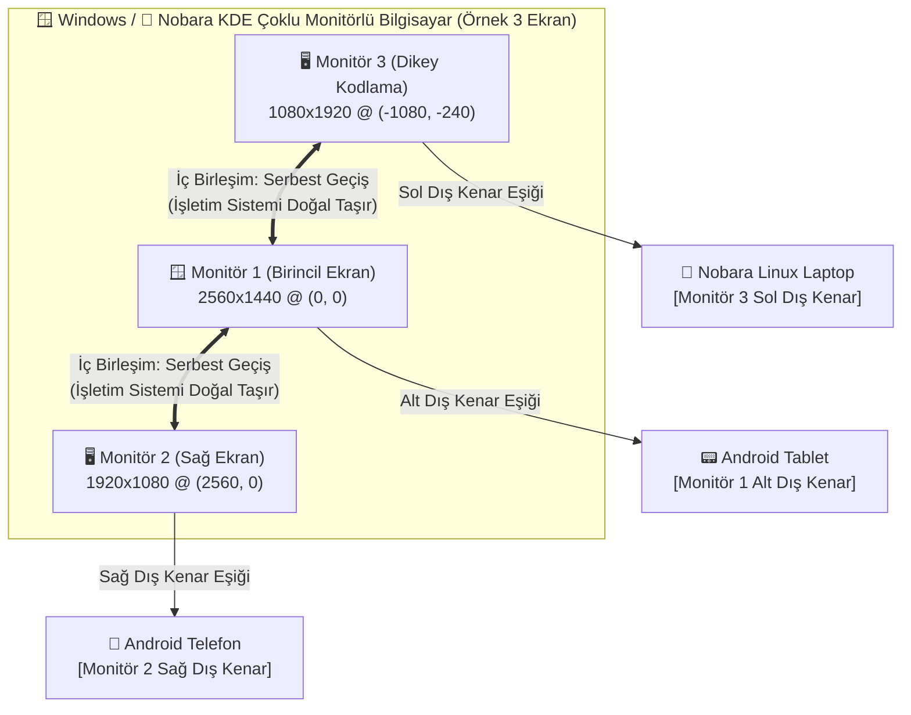

# Connect Me — Application Design Document (ADD)

**Proje Adı:** Connect Me  
**Organizasyon:** Korgan Games (`korgangames/Connect-Me`)  
**Sürüm:** 1.3 (Çoklu Monitör Sanal Masaüstü, Linux Nobara KDE Plasma & Windows Futureproof Edition)  
**Hedef Platformlar:** Windows (10/11), Android (10+), Linux (Nobara — KDE Plasma 5/6 Wayland & X11)  
**Bağlantı Teknolojileri:** Hibrit Wi-Fi (LAN / mDNS / UDP Fast-Path / TCP Framed) + Bluetooth (BLE Keşif & HID)

---

## 1. Vizyon ve Amaç (Executive Summary)

**Connect Me**, kullanıcının çalışma alanındaki **birden fazla bilgisayarı (Windows, Linux/Nobara KDE Plasma vb.)** ve **birden fazla Android cihazı (telefon, tablet)** aynı anda tek bir **Birleşik Uzamsal Çalışma Alanı (Unified Multi-Device Spatial Workspace)** haline getiren, ultra düşük gecikmeli bir cihazlar arası kontrol (Software KVM), ortak pano (Universal Clipboard) ve kesintisiz öğe paylaşım (Seamless Item & File Sharing) ekosistemidir.

### Temel Tasarım Felsefesi
* **Görüntü Aktarımı Yok (Zero Screen Mirroring / No Virtual Display):** Cihazların ekranları birbirine kopyalanmaz ve bir cihaz diğerinin harici ekranı (video sink) yapılmaz. Her cihaz kendi fiziksel ekranını ve kendi donanımını kullanır.
* **Çoklu Fiziksel Monitör Desteği (Multi-Monitor Virtual Desktop):** Bilgisayarlar (Windows veya Nobara Linux) birden fazla fiziksel ekrana (ör. 2'li yatay, 3'lü dikey+yatay) sahip olabilir. Bilgisayarın kendi fiziksel ekranları arasındaki birleşim kenarlarında (Internal Seams) imleç yerel olarak serbestçe geçer; imleç yalnızca dışa açık kenarlara çarptığında Android veya diğer bilgisayara geçer.
* **Çoklu Cihaz (N-to-N Mesh) Desteği:** Aynı anda birden fazla bilgisayar (farklı işletim sistemleri dahil) ve birden fazla Android cihaz tek bir oturumda birbirine bağlanabilir.
* **Ekran Ayarları Tarzı Sürükle-Bırak Konfigürasyon GUI'si:** Tıpkı işletim sistemlerinin çoklu monitör ayarlarında olduğu gibi, bağlı tüm cihazlar ve yerel bilgisayarın tüm monitörleri 2 boyutlu interaktif bir kanvas üzerinde orantısal kutular halinde görselleştirilir ve fareyle sürüklenerek istenilen monitörün kenarına yapıştırılır.
* **Çift Taraflı 6 Haneli Kod Doğrulaması (Mutual Dual-PIN Pairing):** Her cihaz kendi 6 haneli güvenlik kodunu üretir. İki cihazın birbirine bağlanabilmesi için iki tarafın da karşı cihazın 6 haneli kodunu girerek bağlantıyı karşılıklı onaylaması gerekir.

---

## 2. Çoklu Monitör Sanal Masaüstü ve Sistem Mimarisi

Connect Me, hem yerel bilgisayarın hem de uzaktaki bilgisayarların çoklu monitör konfigürasyonlarını yerel olarak anlar ve modeller.

### 2.1. İç Birleşim Çizgisi (Internal Seam) ve Dış Kenar (Exposed Outer Edge) Kuralları
1. **İç Birleşim Çizgisinde Serbest Geçiş (`IsPointOnInternalMonitorSeam`):**
   * Bir bilgisayarın Monitör 1'i ile Monitör 2'si arasındaki temas kenarında imleç hareket ettiğinde, Connect Me imlece müdahale etmez (`ShouldTransition = false`). Windows veya KDE Plasma imleci doğal olarak diğer monitörüne aktarır.
2. **Monitör Bazlı Kenetleme (`AttachedLocalMonitorId`):**
   * Uzak bir cihaz (ör. Android telefon) spesifik bir yerel monitörün kenarına (ör. `DISPLAY2` sağ kenarı) kenetlenebilir.
3. **Negatif Sanal Masaüstü Koordinat Desteği:**
   * Sol veya üst monitörler negatif koordinatlara (`VirtualX = -1080`) sahip olsa bile, uzak cihazdan yerel bilgisayara geri dönüş koordinatları (`ComputeLocalEntryPoint`) tam piksel hassasiyetiyle hedeflenen monitöre indirilir.

---

## 3. Platform Özelinde Çoklu Monitör Mühendisliği

### 3.1. Windows (Win32 Multi-Monitor Detection)
* **`EnumDisplayMonitors` + `GetMonitorInfoW` (`MONITORINFOEXW`):**
  * Tüm bağlı monitörleri, aygıt isimlerini (`\\.\DISPLAY1`), sanal masaüstü dikdörtgenlerini (`rcMonitor.left, top, right, bottom`) ve birincil ekran bayrağını (`MONITORINFOF_PRIMARY`) sorgular.
* **Per-Monitor DPI Ölçek Desteği (`GetDpiForMonitor` - `Shcore.dll`):**
  * Farklı ölçeklerdeki (ör. %100 ve %125) monitörlerin koordinatlarını DPI uyumlu haritalar.
* **Sanal Masaüstü İmleç Sınırlandırması (`ClampToVirtualDesktop`):**
  * Tek ekran yerine tüm çoklu monitör kümesini kapsar; negatif koordinatlı ekranlar arasında serbest harekete olanak tanır.

### 3.2. Linux — Nobara (KDE Plasma Wayland / wlroots / X11)
* **KDE Plasma Wayland (`kscreen-doctor -j`):**
  * Nobara Linux'un varsayılan masaüstü ortamı olan KDE Plasma'da `kscreen-doctor -j` çıktısını JSON olarak okur. `DP-1`, `HDMI-A-1`, `eDP-1` gibi tüm çıkışların `pos: {x, y}`, `size: {width, height}`, `scale` ve `primary / priority` değerlerini anında çözümler.
* **wlroots / Sway / Hyprland (`wlr-randr --json`):**
  * wlroots tabanlı oturumlarda `wlr-randr` JSON çıktısını çözümler.
* **X11 / XWayland (`xrandr --query`):**
  * X11 ve XWayland oturumlarında Regex tabanlı ayrıştırıcı ile tüm ekran geometrilerini haritalar.
* **Wayland Pano & Giriş Entegrasyonu:**
  * `wl-clipboard` (`wl-copy` / `wl-paste`), `libei` / `InputCapture` ve `/dev/uinput` köprüsü.

### 3.3. Android (120Hz Overlay İmleç & Klavye Köprüsü)
* Donanım hızlandırmalı overlay katmanı (`TYPE_APPLICATION_OVERLAY`) üzerinde 120Hz akıcı imleç.
* Ekran klavyesi açılmadan doğrudan metin yazma (`ACTION_SET_TEXT` + Türkçe Unicode).
* Çoklu monitörlü bir bilgisayardan çıkıp Android'e girme ve Android'in kenarından tekrar o bilgisayarın ilgili monitörüne dönme.

---

---

## 4. Kullanıcı Deneyimi ve Güvenlik Mimarisi

* **2 Boyutlu Yakınlaştırılabilir Ekran Haritası (Display Arrangement Canvas):**
  * Yerel bilgisayarın tüm monitörleri (`Monitör 1`, `Monitör 2`, `Monitör 3`) gerçek oranlarıyla çizilir.
  * Monitörler arasındaki iç geçişler kesikli yeşil/turkuaz çizgilerle gösterilir.
  * Uzak cihazlar sürüklenerek istenilen monitörün dış kenarına yapıştırılabilir.
* **`🖥️ +Ek Monitör Testi` Butonu:**
  * Tek tıkla gerçek donanım ekranları, Çift Monitör (Dual) ve Üçlü Monitör (Triple - Dikey Sol) düzenleri arasında geçiş yaparak çoklu monitör topolojisini test etme imkanı.
* **Bu Cihaza Güven ve Hatırla (Sıfır-PIN Otomatik Bağlantı):**
  * İlk eşleşmede `⭐ Bu Cihaza Güven ve Hatırla (Otomatik Bağlan)` seçeneği işaretlendiğinde 24-baytlık (48 karakter hex) kriptografik `TrustToken` üretilir.
  * Token ve ekran konfigürasyonu diske kalıcı olarak yazılır (`%APPDATA%\ConnectMe\trusted_devices.json` veya Linux'ta `~/.config/connectme/trusted_devices.json`, Android'de `SharedPreferences`).
  * İki tarafta da program açık olduğu sürece cihazlar UDP keşfi anında birbirini tanır ve **hiçbir PIN sormadan** `TRUSTED_RECONNECT` TCP protokolü ile anında aktifleşir.
  * Güvenilirlik kaldırılmak istendiğinde arayüzdeki `🗑️ Bu Cihazın Güvenini Kaldır (Unut)` butonuyla tek tıkla silinebilir.

---

## 5. Tamamlanan Yol Haritası (Status)
* [x] **Çoklu Monitör Sanal Masaüstü Desteği (Windows & Linux Nobara KDE Plasma)**
* [x] **İç Birleşim Çizgisi Koruması & Dış Kenar Yönlendirmesi**
* [x] **Çift Taraflı 6 Haneli PIN Doğrulaması**
* [x] **Bu Cihaza Güven ve Hatırla (Sıfır-PIN Otomatik Yeniden Bağlantı)**
* [x] **2D Sekmeli Ferah Arayüz & Yakınlaştırılabilir Kanvas**
* [x] **Evrensel Pano & Drop Shelf Dosya Aktarımı**
* [x] **Nobara Linux Çoklu Monitör Servisi (`linux/connectme_linux_daemon.py`)**
* [x] **31/31 Birim ve Entegrasyon Testi**
