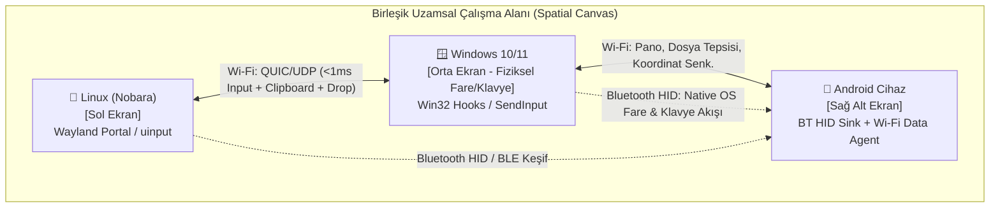

# Connect Me — Application Design Document (ADD)

**Proje Adı:** Connect Me  
**Organizasyon:** Korgan Games (`korgangames/Connect-Me`)  
**Sürüm:** 1.0 (Taslak Mimari ve Gereksinim Dokümanı)  
**Hedef Platformlar:** Windows (10/11), Linux (Nobara / Wayland & X11), Android (10+)  
**Bağlantı Teknolojileri:** Hibrit Wi-Fi (LAN / mDNS / QUIC-UDP-TCP) + Bluetooth (BLE & Classic HID)

---

## 1. Vizyon ve Amaç (Executive Summary)

**Connect Me**, kullanıcının masasında bulunan **Windows**, **Linux (Nobara)** ve **Android** cihazlarını tek bir **Birleşik Çalışma Alanı (Unified Spatial Workspace)** haline getiren, ultra düşük gecikmeli bir cihazlar arası kontrol (Software KVM), ortak pano (Universal Clipboard) ve kesintisiz öğe paylaşım (Seamless Item & File Sharing) ekosistemidir.

### Temel Tasarım Felsefesi
* **Görüntü Aktarımı Yok (Zero Screen Mirroring / No Virtual Display):** Cihazların ekranları birbirine kopyalanmaz ve bir cihaz diğerinin harici ekranı (video sink) yapılmaz. Her cihaz kendi fiziksel ekranını ve kendi donanımını kullanır.
* **Doğal Kenar Geçişi (Edge-Triggered Seamless Hand-off):** Fare imleci aktif cihazın ekran kenarına ulaştığında, tıpkı çift monitörlü bir sistemde yan monitöre geçiyormuş gibi anında diğer cihazın ekranına (PC veya Android) geçer; klavye odağı da otomatik olarak imleci takip eder.
* **Hibrit Kablosuz Sinerji (Wi-Fi + Bluetooth):** Yüksek bant genişliği ve <2ms girdi akışı için **Wi-Fi**, anlık keşif, kesintisiz yedeklilik ve özellikle Android cihazlarda root/ADB gerektirmeden yerel işletim sistemi imleci (Native OS Cursor) oluşturmak için **Bluetooth (BLE + HID)** birlikte kullanılır.

---

## 2. Sistem Mimarisi (High-Level Architecture)

Connect Me, merkezi bir sunucuya ihtiyaç duymayan **Peer-to-Peer (Eşler Arası) Dağıtık Mesh** mimarisiyle çalışır. O an fiziksel klavye ve farenin kullanıldığı cihaz dinamik olarak **Input Source (Aktif Kaynak)**, imlecin üzerinde bulunduğu cihaz ise **Input Sink (Aktif Hedef)** rolünü üstlenir.



### Katmanlı Mimari Yapısı
1. **Keşif ve Eşleşme Katmanı (Discovery & Pairing Layer):**
   * **mDNS / DNS-SD (`_connectme._udp.local`):** Aynı yerel ağdaki (LAN/WLAN) cihazların otomatik keşfi.
   * **BLE Advertisements (Bluetooth Low Energy):** Farklı alt ağlarda (subnet) veya AP izolasyonu olan Wi-Fi ağlarında bile yakındaki cihazları bulma, uyandırma ve el sıkışma (handshake) başlatma.
2. **İletim Katmanı (Transport Layer):**
   * **Kontrol ve Girdi Kanalı (Fast-Path):** QUIC datagramları (veya şifreli UDP) üzerinden sıkıştırılmış ikili (binary) girdi paketleri (`MouseMove`, `MouseButton`, `MouseWheel`, `KeyEvent`).
   * **Veri ve İçerik Kanalı (Data-Path):** Güvenilir QUIC akışları (Streams) veya TLS 1.3 over TCP üzerinden Pano (Clipboard) verisi ve Dosya/Öğe akışı.
   * **Bluetooth HID Kanalı (Android & Fallback Path):** PC'nin Bluetooth adaptörünü standart bir **Bluetooth HID Combo (Mouse + Keyboard + Absolute Pointer)** cihazı olarak sunarak Android'e doğrudan donanım seviyesinde girdi basması.
3. **Platform Soyutlama Katmanı (OS Abstraction Layer - PAL):**
   * Her işletim sisteminin kendine özgü pencere yöneticisi, girdi yakalama/enjekte etme ve dosya sürükleme API'lerini ortak bir Rust arayüzünde (`InputCaptureTrait`, `InputInjectTrait`, `ClipboardTrait`, `DropTargetTrait`) birleştirir.

---

## 3. Platform Özelinde Teknik Çözümler (OS-Specific Engineering)

Bu projenin en kritik mühendislik noktası, üç farklı işletim sisteminin güvenlik ve pencere yöneticisi kısıtlamalarını takılmadan aşmaktır.

### 3.1. Windows (Windows 10 & 11)
* **Girdi Yakalama (Input Capture - Kaynak Cihaz):**
  * `SetWindowsHookEx` (`WH_MOUSE_LL` ve `WH_KEYBOARD_LL`) ile tüm fare ve klavye olayları yakalanır.
  * İmleç başka bir cihaza geçtiğinde yerel ekranda görünmez bir 1x1 piksel pencereye hapsedilir (`ClipCursor`), yerel imleç gizlenir ve olay zincirinde `1` döndürülerek yerel işletim sisteminin tıklamaları/tuşları işlemesi engellenir (suppression).
  * Oyunlarda ve ham girdi kullanan uygulamalarda göreceli hareket (delta `dx, dy`) için `WM_INPUT` (Raw Input API) desteği.
* **Girdi Enjeksiyonu (Input Injection - Hedef Cihaz):**
  * `SendInput` API'si ile donanım tarama kodları (Scan Codes) ve normalize edilmiş mutlak/göreceli fare koordinatları enjekte edilir.
  * *Yetki Seviyesi (UIPI / UAC):* Görev Yöneticisi veya Yönetici (Admin) pencerelerinde imlecin donmaması için arka plan servisi (Windows Service) veya `uiAccess="true"` imzalı yürütülebilir yapı.
* **Pano ve Dosya Sürükleme:**
  * `AddClipboardFormatListener` ile anlık pano takibi (`CF_UNICODETEXT`, `CF_HTML`, `CF_DIBV5` / PNG, `CF_HDROP`).
  * Sanal dosya sürükle-bırak için `IDataObject` ve `IStream` (dosya henüz ağdan inerken hedef klasöre bırakılabilmesini sağlayan gecikmeli akış).

### 3.2. Linux — Nobara (Wayland / KDE Plasma & GNOME)
> [!IMPORTANT]
> **Nobara Linux Özel Durumu:** Nobara (Fedora tabanlı), modern **Wayland** görüntü sunucusunu kullanır. Geleneksel X11 araçları (`xdotool`, `XGrabPointer`) Wayland'de güvenlik mimarisi gereği **çalışmaz**. Bu nedenle Connect Me, Nobara üzerinde çift modlu (Dual-Backend) bir mimari kullanacaktır.

* **Backend 1: Çekirdek Seviyesi `/dev/evdev` + `/dev/uinput` (Önerilen Performans / Oyun Modu):**
  * **Neden?** Masaüstü ortamından (KDE/GNOME/Hyprland) tamamen bağımsızdır, sıfıra yakın gecikme sunar ve hiçbir izin penceresi (popup) çıkarmaz.
  * **Nasıl Çalışır?**
    * *Yakalama:* `/dev/input/event*` cihazlarını okur; imleç başka cihaza geçtiğinde `EVIOCGRAB` ioctl çağrısı ile fiziksel fare/klavyeyi özel olarak yakalar (yerel ekrana girdi gitmez).
    * *Enjeksiyon:* `/dev/uinput` üzerinden çekirdek seviyesinde sanal bir donanım faresi ve klavyesi (`Connect Me Virtual HID`) oluşturur. Wayland kompozitörü bunu gerçek bir USB fare/klavye sanır.
  * *Kurulum Kolaylığı:* Tek seferlik bir `udev` kuralı (`/etc/udev/rules.d/99-connect-me.rules`) ile kullanıcıya `input` ve `uinput` grup izni tanımlanır (uygulamanın root olarak çalışmasına gerek kalmaz).
* **Backend 2: Modern Wayland Portalları & `libei` (Standart Masaüstü Modu):**
  * `org.freedesktop.portal.InputCapture` (ekran kenarı bariyerleri oluşturup imleç kenara çarptığında yakalamak için) ve `org.freedesktop.portal.RemoteDesktop` / `libei` (Emulated Input).
* **Wayland Pano Yönetimi:**
  * `ext-data-control-v1` / `zwlr_data_control_manager_v1` protokolleri ve KDE/GNOME pano eklentileri üzerinden arka planda kesintisiz pano okuma/yazma.

### 3.3. Android (Ekran Yansıtmadan Doğrudan Kontrol)
> [!TIP]
> **Android'de Ekran Yansıtmadan Gerçek Fare İmleci Nasıl Sağlanır?**  
> Android normal şartlarda üçüncü parti bir uygulamanın Wi-Fi üzerinden gerçek sistem imlecini hareket ettirmesine izin vermez. **Connect Me** bu sorunu **Wi-Fi + Bluetooth Hibrit Köprüsü** ile çözer.

Android için **3 Kademeli Girdi Motoru** tasarlanmıştır:

1. **Birincil Mod: Bluetooth HID Köprüsü (Sıfır Root / Sıfır ADB / Gerçek OS İmleci):**
   * Bilgisayar (Windows veya Nobara Linux), Bluetooth üzerinden Android cihaza standart bir **Bluetooth Fare + Klavye (HID Device Profile)** olarak eşleşir.
   * Fare imleci bilgisayar ekranının kenarından Android'in bulunduğu kenara geçtiği anda, bilgisayar girdi paketlerini Bluetooth HID raporları (Absolute/Relative Mouse + Keyboard HID Descriptor) olarak Android'e akıtmaya başlar.
   * **Sonuç:** Android kendi **yerel (native) donanım fare imlecini** 60Hz/120Hz akıcılıkta ekranda gösterir! Kilit ekranında, oyunlarda, banka uygulamalarında ve sistem ayarlarında %100 uyumlu çalışır.
   * İmleç Android ekranının kenarından tekrar bilgisayara döndüğünde, Android üzerindeki koordinat takibi (veya kenar çarpma algısı) bilgisayara sinyali verir ve kontrol tekrar PC'ye geçer.
2. **İkincil Mod (Gelişmiş Wi-Fi Modu): Shizuku / Kablosuz ADB Enjeksiyonu:**
   * Kullanıcı Android 11+ üzerinde **Shizuku** (Kablosuz Hata Ayıklama) yetkisi verdiğinde, Bluetooth'a bile ihtiyaç duymadan doğrudan Wi-Fi üzerinden `InputManager.injectInputEvent` veya sanal girdi cihazı ile <2ms gecikmeli kontrol sağlanır.
3. **Üçüncü Mod (Yedek): AccessibilityService + Overlay Cursor:**
   * Yalnızca Wi-Fi kullanılan ve Bluetooth/Shizuku olmayan durumlarda `SYSTEM_ALERT_WINDOW` ile ekrana özel bir imleç çizilir ve `AccessibilityService.dispatchGesture` ile tıklama/kaydırma hareketleri simüle edilir.

---

## 4. Temel Özellikler ve Kullanıcı Deneyimi (Core Features & UX)

### 4.1. Uzamsal Ekran Dizilimi ve Akıllı Kenar Geçişi (Spatial Layout & Edge Switching)
* **Görsel Harita Editörü (Spatial Canvas UI):**
  * Kullanıcı her cihazın ekranını (boyut ve çözünürlük oranlarıyla) sanal bir masa üzerinde sürükleyip gerçek dünyadaki fiziksel konumuna göre yerleştirir (Örn: Sol: Nobara 27" 1440p, Sağ: Windows 24" 1080p, Sağ Alt: Android Telefon 6.7").
* **Orantısal Kenar Eşleme (Relative Coordinate Mapping):**
  * Farklı çözünürlük ve DPI değerlerine sahip ekranlar arasında geçiş yaparken imleç zıplamaz; paylaşılan kenar segmentinin yüzdesel (`0.0 - 1.0`) karşılığı hesaplanarak diğer ekranda tam hizasından çıkar.
* **İstenmeyen Geçiş Önleyiciler (Edge Guards):**
  * **Köşe Bariyeri (Dead Corners):** Pencere kapatma (`X`) veya başlat menüsü için ekranın en uç köşelerindeki (örn. 15px) pikseller kilitlenir.
  * **Hız / Baskı Eşiği (Edge Resistance):** İmlecin yan ekrana geçmesi için kenara belirli bir hızla çarpması veya kenarda `X` milisaniye (örn. 40ms) boyunca itilmesi gerekir.
  * **Ekran Kilidi Kısayolu (Game Lock):** Tam ekran oyun oynarken `Scroll Lock` veya özelleştirilebilir bir kısayol (`Ctrl+Alt+L`) ile imleç mevcut cihaza kilitlenir.
  * **İmleç Bulucu (Find My Cursor / Edge Glow):** İmleç bir cihazdan diğerine geçtiğinde, girdiği ekranın kenarında zarif, ince bir neon parlama (Edge Ripple) oluşarak kullanıcının gözünün imleci anında yakalamasını sağlar.

### 4.2. Evrensel Pano (Universal Clipboard)
* **Desteklenen Formatlar:**
  * Düz Metin (`UTF-8 Text`), Zengin Metin (`HTML / RTF`), Görseller (`PNG / Bitmap` - ekran görüntüleri dahil) ve Dosya Referansları (`File URI List`).
* **Çalışma Prensibi:**
  * Herhangi bir cihazda kopyalama yapıldığında, meta-veri (boyut, tür, özet hash) anında tüm bağlı cihazlara yayınlanır (`ClipboardAnnounce`).
  * Küçük veriler (<1 MB metin ve küçük görseller) anında arka planda senkronize edilir.
  * Büyük veriler (örn. 50 MB'lık yüksek çözünürlüklü görsel veya kopyalanmış dosyalar) **Lazy Pull (İsteğe Bağlı Çekme)** yöntemiyle çalışır: Kullanıcı hedef cihazda `Ctrl+V` yaptığı anda yüksek hızlı Wi-Fi akışı başlar.
* **Android Pano Kısıtlaması Çözümü:**
  * Android 10+ sürümlerinde arka plandaki uygulamaların panoyu okuması kısıtlanmıştır. Connect Me bunu şu yollarla aşar:
    1. İmleç Android ekranına geçtiğinde (veya klavye odağı aktif olduğunda) tetiklenen hafif **Şeffaf Odak Penceresi / IME (Klavye) Entegrasyonu** veya **Hızlı Ayarlar Kareciği (Quick Settings Tile) / Yüzen Baloncuk**.
    2. `READ_LOGS` / Shizuku izni varsa arka planda tam otomatik senkronizasyon.

### 4.3. Kolay Eşya ve Dosya Paylaşımı (Frictionless Item Sharing)
Kullanıcının cihazlar arasında dosya, fotoğraf, link veya metin parçalarını en doğal şekilde taşıması için **3 tamamlayıcı yöntem** sunulur:

```mermaid
sequenceDiagram
    participant Win as 🪟 Windows (Kaynak)
    participant Shelf as 🧲 Manyetik Cep / Edge Portal
    participant Nob as 🐧 Nobara Linux (Hedef)
    participant And as 📱 Android (Hedef)

    Note over Win,And: Yöntem 1: Doğrudan Kenardan Sürükle-Bırak (Edge Drag & Drop)
    Win->>Shelf: Dosyayı ekranın sol kenarına sürükler
    Shelf->>Nob: İmleç Nobara'ya geçer + "Ghost Drag" başlar
    Nob->>Win: Fare bırakıldığında (Drop) QUIC Stream ile dosyayı çeker

    Note over Win,And: Yöntem 2: Drop Shelf (Cihazlar Arası Ortak Masaüstü Cebi)
    Win->>Shelf: Dosyayı sallar veya kenar cebine bırakır
    Shelf-->>Nob: Ortak Tepside (Shelf) anında belirir
    Shelf-->>And: Android Bildirim / Yüzen Tepsisinde belirir
```

1. **Kenardan Kenara Sürükle-Bırak (Cross-Border Drag & Drop):**
   * Bir dosyayı (veya tarayıcıdaki bir resmi/metni) fareyle tutup ekranın kenarından diğer cihaza doğru geçirdiğinizde, hedef cihazda imlecin ucunda sanal bir sürükleme nesnesi (Ghost Drag Object) oluşur.
   * Fareyi hedef cihazdaki bir klasörün, masaüstünün veya uygulamanın (örn. Discord, Telegram, Kod Editörü) üzerine bıraktığınızda dosya anında oraya aktarılır.
2. **Manyetik Cep / "Drop Shelf" (Yoink / AirDrop Tarzı Ortak Raf):**
   * Özellikle **Android <-> PC** arasında veya hedef klasörün henüz açık olmadığı durumlarda hayat kurtaran özelliktir.
   * Bir dosyayı tutup fareyi hafifçe salladığınızda (Shake) veya ekran kenarına yaklaştırdığınızda küçük, şık bir **"Ortak Cep (Shelf)"** açılır.
   * Oraya bırakılan her eşya (dosya, ekran görüntüsü, link, metin notu) bağlı olan **tüm cihazların** cebinde anında görünür. İstediğiniz cihazdan tutup dışarı sürükleyebilirsiniz.
   * Android tarafında sistem **"Paylaş (Share)"** menüsüne *"Connect Me: Diğer Cihaza Fırlat"* ve *"Connect Me: Ortak Cebe Ekle"* hedefleri eklenir.
3. **Kopyala-Yapıştır (`Ctrl+C` -> `Ctrl+V`) ile Dosya Aktarımı:**
   * Windows Gezgini'nde bir dosyaya `Ctrl+C` yapıp, fareyi Nobara Linux ekranındaki Dolphin/Nautilus dosya yöneticisine geçirip `Ctrl+V` yaptığınızda dosya doğrudan o dizine kopyalanır.

---

## 5. Ağ Protokolü ve Güvenlik (Protocol & Security)

### 5.1. İletişim Protokolü Tasarımı (`ConnectMe Wire Protocol`)
* **Girdi Kanalı (Port: `UDP 42850` / QUIC Datagram):**
  * Sabit boyutlu (8-16 byte), sıfır kopya (zero-copy) serileştirilmiş paketler:
    * `PacketType (1B)` | `Sequence (2B)` | `Timestamp (4B)` | `Payload (DeltaX, DeltaY, Buttons / KeyScanCode)`
  * Nagle algoritması kapalı (`TCP_NODELAY` / QUIC Unreliable Datagram), hedef gecikme: **Wi-Fi 6 üzerinde < 1.5 ms**.
* **Kontrol, Pano ve Dosya Kanalı (Port: `UDP/TCP 42851` / QUIC Streams):**
  * Çoklu akış (Multiplexed Streams): Bir dosya %100 hızla aktarılırken bile fare hareketleri ve pano bildirimleri asla darboğaza (Head-of-Line Blocking) girmez.

### 5.2. Güvenlik ve Şifreleme
* **Zero-Trust Eşleşme (Eşleştirme Akışı):**
  * İlk kurulumda PC ekranında tek kullanımlık bir **QR Kod** (içinde cihazın Public Key parmak izi, yerel IP/Port ve BLE MAC bilgisi bulunur) üretilir. Android cihaz kamerasıyla okuttuğunda veya diğer PC'de **6 Haneli PIN** onaylandığında cihazlar birbirinin `Ed25519` sertifikalarını Güvenilir Cihazlar Halka Anahtarlığına (Trust Store) kaydeder.
* **Uçtan Uca Şifreleme (mTLS 1.3 / Noise Protocol):**
  * Aynı Wi-Fi ağındaki (örn. kafe, ofis veya ev ağı) hiçbir yabancı cihaz tuş vuruşlarını, şifreleri veya pano içeriğini dinleyemez (Man-in-the-Middle korumalı).

---

## 6. Önerilen Teknoloji Yığını (Tech Stack)

Performans, düşük bellek tüketimi ve üç platformda ortak kod paylaşımı için önerilen teknoloji yığını:

| Katman | Teknoloji Seçimi | Gerekçe |
| :--- | :--- | :--- |
| **Çekirdek Motor (Core Daemon & Ağ)** | **Rust** (`tokio`, `quinn` [QUIC], `rustls`, `mdns-sd`, `btleplug`) | Çöp toplayıcı (GC) duraksaması yoktur, <1ms girdi gecikmesi sağlar, hem Windows hem Linux hem Android (JNI/UniFFI) üzerinde ortak derlenir. |
| **Windows Girdi & Sistem** | `windows-rs` (Win32 Hooks, `SendInput`, OLE Drag&Drop, WinRT BLE) | Doğrudan yerel Win32 ve WinRT API erişimi. |
| **Linux (Nobara) Girdi & Sistem** | `evdev`, `uinput-tokio`, `ashpd` (Wayland Portals), `wl-clipboard-rs`, `bluer` (BlueZ BT HID) | Nobara'nın Wayland ortamında hem çekirdek (`uinput`) hem de modern Portal (`libei`) seviyesinde tam uyumluluk. |
| **Masaüstü Arayüzü (Windows & Linux UI)** | **Tauri v2** (Rust Backend + TypeScript/React veya Svelte) *veya* **Slint / Iced** | Sistem tepsisinde (System Tray) sessizce çalışır; yalnızca ayarlar veya "Drop Shelf" açıldığında hafif bir pencere/overlay oluşturur. |
| **Android Uygulaması** | **Kotlin & Jetpack Compose** + **Rust Core (`cargo-ndk` / `UniFFI`)** | Android'in yerel servislerine (`BluetoothHidDevice`, `AccessibilityService`, `ForegroundService`, `ShareTarget`, `Shizuku`) %100 doğal erişim + ortak Rust ağ motoru. |

---

## 7. Proje Dizin Yapısı (Monorepo Workspace)

```text
Connect-Me/
├── Cargo.toml                 # Rust Workspace tanımı
├── docs/
│   └── ADD.md                 # Uygulama Tasarım Dokümanı (Bu belge)
├── crates/
│   ├── cm-core/               # Ortak veri tipleri, ekran topolojisi ve kenar matematiği
│   ├── cm-protocol/           # QUIC/UDP ağ protokolü, mTLS, mDNS ve BLE keşif
│   ├── cm-input/              # Windows (Win32) ve Linux (Nobara Wayland/uinput) KVM motoru
│   ├── cm-clipboard/          # Evrensel pano izleyicisi ve içerik senkronizasyonu
│   └── cm-transfer/           # Dosya akışı, Drop Shelf ve Sürükle-Bırak sanal nesneleri
├── apps/
│   ├── desktop/               # Windows & Linux (Nobara) Masaüstü / Tray Uygulaması & Overlay
│   └── android/               # Kotlin + Jetpack Compose + Rust JNI Android Uygulaması
└── scripts/
    └── linux-udev-setup.sh    # Nobara/Linux için tek tıkla uinput/Bluetooth HID izin kurulumu
```

---

## 8. Geliştirme Yol Haritası (Phased Roadmap)

### Faz 1: Temel İskelet & PC <-> PC (Windows & Nobara) Kenar Geçişi (MVP)
* [ ] Rust Workspace ve `cm-protocol` (mDNS keşif + QUIC güvenli bağlantı) kurulumu.
* [ ] Windows (`WH_MOUSE_LL`/`SendInput`) ve Nobara Linux (`evdev`/`uinput` + Wayland Portal) girdi yakalama ve enjeksiyon modüllerinin yazılması.
* [ ] Sanal ekran topolojisi (Sol/Sağ/Üst/Alt kenar matematiği) ve fare ekran kenarına çarptığında diğer bilgisayara <2ms gecikmeyle geçişinin sağlanması.
* [ ] Acil durum ekran kilidi / kurtarma kısayolu (`Ctrl+Alt+Shift+Esc` veya `Scroll Lock`).

### Faz 2: Evrensel Pano & "Drop Shelf" (Manyetik Ortak Cep)
* [ ] Windows ve Nobara Wayland arasında metin, HTML ve ekran görüntüsü (PNG) pano senkronizasyonu.
* [ ] Ekran kenarında açılan **Drop Shelf (Manyetik Tepsi)** arayüzü ve QUIC üzerinden yüksek hızlı dosya transferi.
* [ ] Sistem tepsisi (System Tray) ve görsel ekran dizilim editörü (Spatial Canvas UI).

### Faz 3: Android Entegrasyonu (Wi-Fi + Bluetooth HID Sinerjisi)
* [ ] Android uygulamasının (Kotlin + Rust Core) oluşturulması ve QR kod ile eşleşme.
* [ ] PC <-> Android arasında **Bluetooth HID (Mouse + Keyboard)** köprüsünün kurulması: İmleç PC kenarından Android'e geçtiğinde Android'de yerel donanım imlecinin belirmesi ve klavyenin Android'e yazması.
* [ ] Android Evrensel Pano ve Sistem "Paylaş" menüsü <-> Drop Shelf entegrasyonu.
* [ ] Opsiyonel Shizuku (Wi-Fi üzerinden doğrudan enjeksiyon) modunun eklenmesi.

### Faz 4: Kenardan Sürükle-Bırak (Cross-Border Drag & Drop) & Cilalama
* [ ] Dosyayı doğrudan ekran kenarından diğer ekrana sürükleyip bırakma (Ghost Drag & Sanal `IDataObject` / Wayland DataSource).
* [ ] Kenar parlaması (Edge Glow), DPI normalizasyonu, hız eşiği (Edge Resistance) ve bağlantı kopma/uyku (Sleep/Wake) senaryolarının kusursuzlaştırılması.

---

## 9. Açık Tasarım Soruları ve Karar Noktaları

Geliştirmeye (Faz 1) başlamadan önce netleştirebileceğimiz tercihler:
1. **Öncelikli İlk İkili:** İlk prototipi **Windows <-> Nobara Linux** arasında mı yoksa **PC <-> Android** arasında mı test ederek başlamak istersin?
2. **Linux (Nobara) Masaüstü Ortamı:** Nobara'da **KDE Plasma (Wayland)** mı yoksa **GNOME (Wayland)** mı kullanıyorsun? (Hem `uinput` hem de masaüstü portallarını buna göre önceliklendireceğiz).
3. **Android Kontrol Tercihi:** Android'de birincil yöntem olarak **Bluetooth HID (gerçek yerel Android fare imleci, sıfır ADB)** yaklaşımını mı, yoksa **Shizuku / Wi-Fi** yaklaşımını mı, yoksa her ikisini birden (Hibrit) mi destekleyelim? (Dokümanda her ikisini kapsayan hibrit mimariyi temel aldık).
