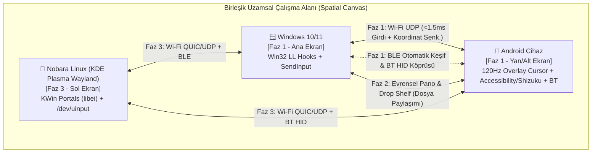

# Connect Me — Application Design Document (ADD)

**Proje Adı:** Connect Me  
**Organizasyon:** Korgan Games (`korgangames/Connect-Me`)  
**Sürüm:** 1.1 (Windows <-> Android Faz 1 Odaklı & Nobara KDE Plasma Wayland Mimarisi)  
**Hedef Platformlar:** Windows (10/11), Android (10+), Linux (Nobara — KDE Plasma Wayland)  
**Bağlantı Teknolojileri:** Hibrit Wi-Fi (LAN / mDNS / QUIC-UDP-TCP) + Bluetooth (BLE Keşif & HID)

---

## 1. Vizyon ve Amaç (Executive Summary)

**Connect Me**, kullanıcının masasında bulunan **Windows**, **Android** ve **Linux (Nobara - KDE Plasma)** cihazlarını tek bir **Birleşik Çalışma Alanı (Unified Spatial Workspace)** haline getiren, ultra düşük gecikmeli bir cihazlar arası kontrol (Software KVM), ortak pano (Universal Clipboard) ve kesintisiz öğe paylaşım (Seamless Item & File Sharing) ekosistemidir.

### Temel Tasarım Felsefesi
* **Görüntü Aktarımı Yok (Zero Screen Mirroring / No Virtual Display):** Cihazların ekranları birbirine kopyalanmaz ve bir cihaz diğerinin harici ekranı (video sink) yapılmaz. Her cihaz kendi fiziksel ekranını ve kendi donanımını kullanır.
* **Doğal Kenar Geçişi (Edge-Triggered Seamless Hand-off):** Fare imleci aktif cihazın ekran kenarına ulaştığında, tıpkı çift monitörlü bir sistemde yan monitöre geçiyormuş gibi anında diğer cihazın ekranına (Android veya PC) geçer; klavye odağı da otomatik olarak imleci takip eder.
* **Hibrit Kablosuz Sinerji (Wi-Fi + Bluetooth):** Yüksek bant genişliği ve `<2ms` girdi akışı için **Wi-Fi (UDP/QUIC)**; anlık yakınlık keşfi, otomatik eşleşme, uyandırma ve yedek kontrol kanalı için **Bluetooth (BLE + HID)** birlikte kullanılır.

---

## 2. Sistem Mimarisi (High-Level Architecture)

Connect Me, merkezi bir sunucuya ihtiyaç duymayan **Peer-to-Peer (Eşler Arası) Dağıtık Mesh** mimarisiyle çalışır. O an fiziksel klavye ve farenin kullanıldığı cihaz dinamik olarak **Input Source (Aktif Kaynak)**, imlecin üzerinde bulunduğu cihaz ise **Input Sink (Aktif Hedef)** rolünü üstlenir.



### Katmanlı Mimari Yapısı
1. **Keşif ve Eşleşme Katmanı (Discovery & Pairing Layer):**
   * **mDNS / DNS-SD (`_connectme._udp.local`):** Aynı yerel ağdaki (LAN/WLAN) cihazların sıfır ayar ile otomatik keşfi.
   * **BLE Advertisements (Bluetooth Low Energy):** Farklı alt ağlarda (subnet) veya AP izolasyonu olan Wi-Fi ağlarında bile yakındaki cihazları bulma, el sıkışma (handshake) başlatma ve ekran uyandırma.
2. **İletim Katmanı (Transport Layer):**
   * **Kontrol ve Girdi Kanalı (Fast-Path):** UDP / QUIC datagramları üzerinden sıkıştırılmış ikili (binary) girdi paketleri (`MouseMove`, `MouseButton`, `MouseWheel`, `KeyEvent`, `EdgeHandOff`).
   * **Veri ve İçerik Kanalı (Data-Path):** Güvenilir QUIC akışları (Streams) veya TLS 1.3 over TCP üzerinden Pano (Clipboard) verisi ve Dosya/Öğe akışı.
   * **Bluetooth Kanalı (BLE + HID):** Yakınlık tespiti, düşük gecikmeli durum senkronizasyonu ve desteklenen adaptörlerde doğrudan HID fare/klavye profili sunumu.
3. **Platform Soyutlama Katmanı (OS Abstraction Layer - PAL):**
   * Her işletim sisteminin kendine özgü pencere yöneticisi, girdi yakalama/enjekte etme ve dosya sürükleme API'lerini ortak bir arayüzde (`InputCapture`, `InputInject`, `ClipboardSync`, `DropShelf`) birleştirir.

---

## 3. Platform Özelinde Teknik Çözümler (OS-Specific Engineering)

### 3.1. Windows (Windows 10 & 11) — [Faz 1 Birincil Kaynak/Hedef]
* **Girdi Yakalama (Input Capture):**
  * `SetWindowsHookEx` (`WH_MOUSE_LL` ve `WH_KEYBOARD_LL`) ile tüm fare ve klavye olayları işletim sistemi kuyruğuna girmeden önce yakalanır.
  * İmleç Android'e (veya Linux'a) geçtiği anda:
    1. Yerel Windows imleci şeffaf bir 1x1 piksel çapa penceresine hapsedilir (`ClipCursor`) ve gizlenir.
    2. Fare hareketleri merkeze sıfırlanarak sonsuz delta (`dx, dy`) üretilir.
    3. Hook fonksiyonu `LRESULT(1)` döndürerek tıklamaların ve tuş vuruşlarının Windows'taki pencerelere gitmesini %100 engeller (Input Suppression).
* **Girdi Enjeksiyonu (Input Injection):**
  * Android veya Linux'tan Windows'a kontrol geçtiğinde `SendInput` API'si ile donanım tarama kodları (Scan Codes) ve normalize edilmiş fare koordinatları enjekte edilir.
  * *Yetki Seviyesi (UIPI / UAC):* Görev Yöneticisi veya Yönetici (Admin) pencerelerinde imlecin takılmaması için uygulama yükseltilmiş yetki / `uiAccess` mimarisiyle çalışır.
* **Pano ve Dosya Sürükleme:**
  * `AddClipboardFormatListener` ile anlık pano takibi (`CF_UNICODETEXT`, `CF_HTML`, `CF_DIBV5` / PNG, `CF_HDROP`).

### 3.2. Android (Ekran Yansıtmadan Doğrudan Kontrol) — [Faz 1 Birincil Hedef/Kaynak]
> [!IMPORTANT]
> **Windows'tan Android'e Kenar Geçişinde Kusursuz Koordinat ve İmleç Çözümü:**  
> İmleç Windows ekranının kenarından Android'e geçtiğinde tam olarak hangi yükseklikten (`Y %`) girdiyse Android ekranında o noktadan çıkmalı, Android ekranının kenarına geri geldiğinde ise anında Windows ekranına geri dönmelidir.

Bu kusursuz geçişi sağlamak için Android tarafında **Koordinat Takipli Hibrit Girdi Motoru** kullanılır:

1. **120Hz Donanım Hızlandırmalı Overlay İmleç + Accessibility Enjeksiyonu (Sıfır Root / Sıfır ADB — Anında Kurulum):**
   * **Hassas Koordinat Takibi:** Android servisi (`ConnectMeCursorService`), telefonun/tabletin tam ekran çözünürlüğünü (`Width x Height`) bilir ve `TYPE_APPLICATION_OVERLAY` (`FLAG_NOT_FOCUSABLE | FLAG_NOT_TOUCHABLE | FLAG_LAYOUT_NO_LIMITS`) katmanında 60/120Hz akıcılıkta gerçek bir fare imleci çizer.
   * **Kenardan Giriş ve Çıkış:** İmleç Windows'un sağ kenarından `%40` yüksekliğinde çıktığında, Android ekranının sol kenarında `(X = 0, Y = 0.40 * Height)` noktasında belirir. Kullanıcı fareyi sola çekip Android'de `X < 0` sınırına çarptığı anda Android servisi `EdgeHandOff(Windows, y_ratio)` paketini Windows'a gönderir, kendi imlecini gizler ve imleç anında Windows'ta aynı noktadan çıkar!
   * **Tıklama, Kaydırma ve Sürükleme:**
     * *Sol Tık & Sürükle:* `AccessibilityService.dispatchGesture` ile milisaniyelik dokunma ve sürükleme (Swipe/Drag) hareketine dönüştürülür.
     * *Tekerlek (Scroll Wheel):* İmlecin bulunduğu noktada yukarı/aşağı pürüzsüz kaydırma hareketi üretir.
     * *Sağ Tık & Orta Tık:* Sağ tık -> Android `GLOBAL_ACTION_BACK` (Geri), Orta tık -> `GLOBAL_ACTION_HOME` (Ana Ekran) veya Son Uygulamalar.
   * **Fiziksel Klavye Köprüsü (Ekran Klavyesini Açmadan Yazma):**
     * Windows klavyesinden yazılan metinler ve kısayollar (`Backspace`, `Enter`, `Ctrl+A/C/V`, Ok tuşları) `AccessibilityNodeInfo.ACTION_SET_TEXT` ve `ConnectMe Virtual IME (InputMethodService)` üzerinden doğrudan aktif metin kutusuna iletilir; ekran klavyesi açılıp ekranı kaplamaz.
2. **Pro Mod (Shizuku / Kablosuz ADB veya Bluetooth HID):**
   * Kullanıcı isterse **Shizuku** (Android 11+ Kablosuz Hata Ayıklama) veya **Bluetooth HID** modunu aktif ederek Android'in kendi yerel `InputManager` imlecini ve oyun içi tam donanım enjeksiyonunu kullanabilir.

### 3.3. Linux — Nobara (KDE Plasma / Wayland) — [Faz 3]
> [!NOTE]
> **Nobara KDE Plasma (Wayland) Avantajı:** KDE Plasma'nın pencere yöneticisi olan **KWin**, Wayland dünyasında `InputCapture` ve `RemoteDesktop` (`libei`) standartlarını en iyi destekleyen kompozitördür.

Nobara KDE Plasma üzerinde **Çift Katmanlı (Dual-Backend)** mimari uygulanacaktır:
* **Katman 1: KDE Plasma KWin Wayland Portalları (`ashpd` / `libei`):**
  * `org.freedesktop.portal.InputCapture`: KWin üzerinde sanal ekran kenarı bariyeri (Pointer Barrier) oluşturur. İmleç kenara çarptığında KWin imleci kilitler ve ham `dx, dy` akışını Connect Me'ye teslim eder.
  * `org.freedesktop.portal.RemoteDesktop`: Diğer cihazdan gelen fare/klavye olaylarını KWin'e yerel olarak enjekte eder.
* **Katman 2: Çekirdek Seviyesi `/dev/evdev` + `/dev/uinput` (Tam Ekran Oyun & Sıfır İzin Penceresi Modu):**
  * Tek seferlik `udev` kuralı ile `/dev/uinput` üzerinde `Connect Me Virtual HID` donanımı oluşturur. KDE Plasma Wayland ve XWayland (Steam/Proton oyunları) bunu gerçek bir fiziksel USB fare ve klavye olarak görür.
* **KDE Plasma Pano Entegrasyonu:**
  * KDE `Klipper` (DBus `org.kde.klipper`) ve Wayland `ext-data-control-v1` protokolü ile arka planda tam otomatik pano senkronizasyonu.

---

## 4. Temel Özellikler ve Kullanıcı Deneyimi (Core Features & UX)

### 4.1. Uzamsal Ekran Dizilimi ve Akıllı Kenar Geçişi (Spatial Layout & Edge Switching)
* **Görsel Harita Editörü (Spatial Canvas UI):**
  * Kullanıcı Windows ekranını ve Android telefonunu/tabletini (ve Faz 3'te Nobara Linux'u) sanal bir masa üzerinde sürükleyip gerçek dünyadaki fiziksel konumuna göre yerleştirir (Örn: Ortada Windows 27", Sağ Altta Android Telefon).
* **Orantısal Kenar Eşleme (Relative Coordinate Mapping):**
  * Farklı çözünürlük ve DPI değerlerine sahip ekranlar arasında geçiş yaparken imleç zıplamaz; paylaşılan kenar segmentinin yüzdesel (`0.0 - 1.0`) karşılığı hesaplanarak diğer ekranda tam hizasından çıkar.
* **İstenmeyen Geçiş Önleyiciler (Edge Guards):**
  * **Köşe Bariyeri (Dead Corners):** Pencere kapatma (`X`) veya görev çubuğu için ekranın en uç köşelerindeki (örn. 20px) pikseller kilitlenir.
  * **Hız / Baskı Eşiği (Edge Resistance):** İmlecin yan ekrana geçmesi için kenarda `X` milisaniye (örn. 35ms) boyunca itilmesi veya belirli bir hızla çarpması gerekir.
  * **Ekran Kilidi Kısayolu (Game Lock):** Tam ekran oyun oynarken `Scroll Lock` veya `Ctrl+Alt+L` ile imleç mevcut cihaza kilitlenir; acil kurtarma kısayolu (`Ctrl+Alt+Shift+Esc`) her zaman imleci ana bilgisayara geri çağırır.
  * **Kenar Parlaması (Edge Glow):** İmleç bir cihazdan diğerine geçtiğinde, girdiği ekranın kenarında zarif bir görsel vurgu oluşarak kullanıcının gözünün imleci anında yakalamasını sağlar.

### 4.2. Evrensel Pano (Universal Clipboard)
* **Desteklenen Formatlar:**
  * Düz Metin (`UTF-8 Text`), Zengin Metin (`HTML`), Görseller (`PNG / JPEG` - ekran görüntüleri dahil) ve Dosya Referansları.
* **Çalışma Prensibi:**
  * Windows'ta `Ctrl+C` yapıldığında metin veya ekran görüntüsü anında Android panosuna düşer (Android'de uzun basıp "Yapıştır" yapılabilir veya Windows klavyesinden `Ctrl+V` basılabilir).
  * Android'de kopyalanan metin veya görsel, imleç/odak aktifken veya Hızlı Ayarlar / Yüzen Cep üzerinden anında Windows panosuna aktarılır.

### 4.3. Kolay Eşya ve Dosya Paylaşımı (Frictionless Item Sharing)
Kullanıcının cihazlar arasında dosya, fotoğraf, APK, link veya metin parçalarını en doğal şekilde taşıması için **3 tamamlayıcı yöntem** sunulur:

```mermaid
sequenceDiagram
    participant Win as 🪟 Windows
    participant Shelf as 🧲 Manyetik Cep (Drop Shelf)
    participant And as 📱 Android

    Note over Win,And: Yöntem 1: Kenardan Sürükle-Bırak (Edge Drag & Drop)
    Win->>Shelf: Dosyayı ekranın Android yönündeki kenarına sürükler
    Shelf->>And: İmleç Android'e geçer + Dosya önizleme balonu imleci takip eder
    And->>Win: Android ekranında bırakıldığında dosya yüksek hızla (Wi-Fi) iner ve açılır

    Note over Win,And: Yöntem 2: Manyetik Cep / Drop Shelf (Çift Yönlü Ortak Raf)
    And->>Shelf: Android "Paylaş -> Connect Me Cep" veya yüzen cebe sürükleme
    Shelf-->>Win: Windows ekran kenarındaki Ortak Cepte anında belirir (Masaüstüne sürükle-bırak!)
```

1. **Kenardan Kenara Sürükle-Bırak (Cross-Border Drag & Drop):**
   * Windows'ta bir dosyayı fareyle tutup Android'in bulunduğu ekran kenarından geçirdiğinizde, Android ekranında imlecin yanında dosyanın simgesi/önizlemesi taşınır; bıraktığınızda dosya Android'e iner ve ilgili uygulamada/klasörde açılır.
2. **Manyetik Cep / "Drop Shelf" (Çift Yönlü Ortak Raf):**
   * Bir dosyayı tutup fareyi hafifçe salladığınızda (Shake) veya ekran kenarına yaklaştırdığınızda küçük, şık bir **"Ortak Cep (Shelf)"** açılır.
   * Oraya bırakılan her eşya (dosya, ekran görüntüsü, link, metin notu) hem Windows'ta hem Android'de (ve Nobara'da) ortak cepte anında görünür.
   * Android'den Windows'a fotoğraf/dosya atmak için Android'in **"Paylaş (Share)"** menüsünden *"Connect Me"* seçilmesi veya Android üzerindeki yüzen cebe bırakılması yeterlidir; Windows'ta cepten tutup doğrudan masaüstüne veya istediğiniz programa (Discord, WhatsApp, VS Code vb.) sürükleyip bırakabilirsiniz!
3. **Kopyala-Yapıştır (`Ctrl+C` -> `Ctrl+V`) ile Dosya Aktarımı:**
   * Bir cihazda kopyalanan dosyayı diğer cihazda doğrudan `Ctrl+V` ile indirme/yapıştırma.

---

## 5. Ağ Protokolü ve Güvenlik (Protocol & Security)

### 5.1. İletişim Protokolü Tasarımı (`ConnectMe Wire Protocol`)
* **Girdi Kanalı (Port: `UDP 42850`):**
  * Sabit boyutlu, düşük gecikmeli ikili (binary) paketler:
    * `0x01 MouseMove { dx: i16, dy: i16, seq: u16 }`
    * `0x02 MouseButton { button: u8, pressed: bool }`
    * `0x03 MouseScroll { wheel_x: i16, wheel_y: i16 }`
    * `0x04 KeyEvent { key_code: u16, scan_code: u16, pressed: bool, modifiers: u8 }`
    * `0x05 EdgeHandOff { target_device_id: u8, edge: u8, normalized_pos: f32 }`
* **Kontrol, Pano ve Dosya Kanalı (Port: `TCP/QUIC 42851`):**
  * JSON/MessagePack kontrol mesajları (`DeviceHello`, `LayoutSync`, `ClipboardAnnounce`, `ShelfItemAdded`) ve paralel ikili (binary) dosya akışı.
* **Keşif Kanalı (UDP Broadcast / mDNS `42849` + BLE Advertisements):**
  * Cihazların IP adresi girmeden birbirini saniyeler içinde otomatik bulmasını sağlar.

### 5.2. Güvenlik ve Şifreleme
* **Zero-Trust Eşleşme:** İlk bağlantıda Windows ekranında gösterilen **QR Kod** Android kamerasıyla okutularak veya **6 Haneli PIN** onaylanarak cihazlar eşleşir ve ortak şifreleme anahtarı (`X25519` / `ChaCha20-Poly1305` veya `TLS 1.3`) kaydedilir.

---

## 6. Proje Dizin Yapısı (Monorepo Workspace)

```text
Connect Me/
├── docs/
│   └── ADD.md                 # Uygulama Tasarım Dokümanı (Bu belge)
├── protocol/                  # Ortak protokol şemaları ve paket tanımları
├── windows/                   # Windows Masaüstü Uygulaması (Win32 Hooks, Tray UI, Drop Shelf, Ağ Motoru)
├── android/                   # Android Uygulaması (Kotlin/Compose, 120Hz Overlay Cursor, Accessibility, ShareTarget)
└── linux-nobara/              # [Faz 3] Nobara KDE Plasma (Wayland KWin Portal + uinput) İstemcisi
```

---

## 7. Geliştirme Yol Haritası (Phased Roadmap)

### Faz 1: Windows <-> Android Çekirdek Bağlantı ve Kenar Geçişli Kontrol (MVP) 🎯 *[Şu Anki Hedef]*
* [ ] **Ağ ve Otomatik Keşif:** Windows ve Android'in aynı Wi-Fi ağında (UDP Broadcast / mDNS) ve BLE ile birbirini otomatik bulması + QR/PIN ile eşleşmesi.
* [ ] **Windows Input Capture & Edge Engine:** Windows'ta fare ekran kenarına (`Sol/Sağ/Üst/Alt`) ulaştığında yerel imlecin kilitlenip gizlenmesi (`WH_MOUSE_LL`, `WH_KEYBOARD_LL`, `ClipCursor`) ve girdilerin `<1.5ms` gecikmeyle Android'e akıtılması.
* [ ] **Android 120Hz Overlay İmleç & Kontrol Servisi:** Android ekranında donanım hızlandırmalı gerçek fare imleci çizimi, tıklama/kaydırma/geri/ana ekran hareketleri (`AccessibilityService`), fiziksel klavyeden doğrudan metin yazma ve Android ekran kenarından tekrar Windows'a pürüzsüz geri geçiş.
* [ ] **Görsel Ekran Konumlandırma & Acil Kurtarma:** Windows üzerinde Android cihazın hangi kenarda durduğunu seçme arayüzü ve `Ctrl+Alt+L` / `Scroll Lock` kilit kısayolu.

### Faz 2: Windows <-> Android Evrensel Pano & "Drop Shelf" (Eşya Paylaşımı)
* [ ] Windows ve Android arasında çift yönlü metin ve görsel (ekran görüntüsü) pano senkronizasyonu.
* [ ] Windows ekran kenarında açılan **Manyetik Cep (Drop Shelf)** ve Android **"Paylaş -> Connect Me"** / Yüzen Cep entegrasyonu ile sürükle-bırak dosya paylaşımı.
* [ ] Kenardan doğrudan dosya sürükleyip Android ekranına bırakma (Cross-Border Drag & Drop).

### Faz 3: Nobara Linux (KDE Plasma Wayland) Entegrasyonu
* [ ] Nobara KDE Plasma için `KWin` Wayland (`InputCapture` & `RemoteDesktop` / `libei`) ve `/dev/evdev` + `/dev/uinput` girdi motorunun geliştirilmesi.
* [ ] KDE Plasma Wayland pano (`ext-data-control-v1` / `Klipper`) ve Drop Shelf arayüzünün eklenmesi.

### Faz 4: Üçlü Ekosistem (Windows + Nobara KDE + Android) Tam Senkronizasyon & Cilalama
* [ ] Üç cihaz arasında çoklu kenar topolojisi (Örn: Sol: Nobara, Orta: Windows, Sağ Alt: Android).
* [ ] Kenar parlaması (Edge Glow), gelişmiş Bluetooth HID / Shizuku modları ve uyku/uyanma (Sleep/Wake) optimizasyonları.
